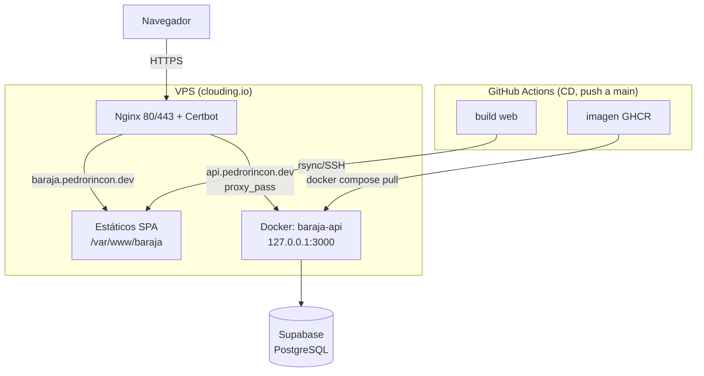

# barajaAPI


API REST y aplicación web de la baraja española.

- **Web:** https://baraja.pedrorincon.dev
- **API:** https://api.pedrorincon.dev - Swagger en [/api/docs](https://api.pedrorincon.dev/api/docs)

Monorepo (npm workspaces) con dos aplicaciones: `apps/api` (Express + Prisma) y `apps/web` (React + Vite).

🚧 Proyecto en desarrollo [ROADMAP](./ROADMAP.md).

## Tecnologías

#### Backend

- Node.js 24 + TypeScript (ESM)
- Express 5
- Vitest + Supertest (testing)
- Helmet y CORS (seguridad)
- dotenv (variables de entorno)
- Zod (validación de variables de entorno)
- ESLint + Prettier (calidad de código)
- GitHub Actions (CI)
- PostgreSQL
- Prisma (ORM)
- pino (logging)
- OpenAPI / Swagger (docs)

#### Frontend

- React 19
- Vite
- TypeScript
- Tailwind CSS 4
- Vitest + Testing Library
- Cliente tipado generado del OpenAPI

## Requisitos

- Node.js >= 24
- npm >= 11

## Instalación

```bash
git clone https://github.com/P-Drop/barajaAPI.git
cd barajaAPI
npm install
```

## Variables de entorno

`cp apps/api/.env.example apps/api/.env`

| Variable             | Descripción                                           |
| -------------------- | ----------------------------------------------------- |
| DATABASE_URL         | Cadena de conexión a PostgreSQL                       |
| PORT                 | Puerto del servidor (3000)                            |
| CORS_ORIGIN          | Origen permitido (\* en dev)                          |
| NODE_ENV             | development / production / test                       |
| LOG_LEVEL            | Nivel de pino (info por defecto)                      |
| POSTGRES\_\*         | (raíz) credenciales del contenedor                    |
| RATE_LIMIT_MAX       | Máx. de peticiones por IP y ventana (100 por defecto) |
| RATE_LIMIT_WINDOW_MS | Ventana del rate limit en ms (900000 = 15 min)        |

## Scripts

Se ejecutan dentro de `apps/api` (o desde la raíz con -w api):

| **Script**                 | **Qué hace**                                    |
| -------------------------- | ----------------------------------------------- |
| `npm run dev`              | Levanta el servidor en desarrollo (con recarga) |
| `npm run build`            | Compila TypeScript a `dist/`                    |
| `npm start`                | Arranca el servidor ya compilado                |
| `npm test`                 | Ejecuta los tests una vez                       |
| `npm run test:watch`       | Ejecuta los tests en modo watch                 |
| `npm run test:integration` | Tests contra la BD real (requiere Docker)       |
| `npm run test:coverage`    | Tests con cobertura (utilizado en CI/CD)        |

Ejemplo:

```bash
cd apps/api
npm run dev
```

**Calidad** (desde la raíz):

| **Script**             | **Qué hace**                          |
| ---------------------- | ------------------------------------- |
| `npm run lint`         | Analiza el código con ESLint          |
| `npm run format`       | Formatea el código con Prettier       |
| `npm run format:check` | Verifica el formato (utilizado en CI) |

## Desarrollo (con Docker):

```bash
# 1. Levantar PostgreSQL
docker compose up -d

# 2. Migrar y sembrar
cd apps/api
npx prisma migrate deploy && npx prisma db seed

# 3. Arrancar en modo desarrollo (logs legibles)
npm run dev
```

## Endpoints

Comprueba que la API está funcionando:

- `GET /api/health` — liveness
- `GET /api/health/ready` — readiness

Operaciones:

- `GET /api/v1/deck` — baraja (`?short=true` para la de 40)
- `GET /api/v1/deck/shuffle` — baraja barajada
- `GET /api/v1/deck/draw?count=N` — robar N cartas

📖 Documentación interactiva (Swagger): http://localhost:3000/api/docs

## Frontend (`apps/web`)


SPA en React 19 + Vite + TypeScript + Tailwind CSS 4 que consume la API pública: muestra la baraja completa (48 cartas + 2 comodines), permite barajarla con un clic y alternar entre baraja completa (48) y corta (40).

- **Cliente tipado desde el OpenAPI:** los tipos se generan del spec de la API (`npm run gen:api -w web` → `src/api/generated/schema.d.ts`, versionado), así el contrato front-back no puede desincronizarse en silencio.

- **Variables de entorno:** `VITE_API_BASE_URL` (`.env.development` → API local, `.env.production` → API pública). Vite las **embebe en build-time**: la URL queda congelada en el bundle, no se lee en runtime.

```bash
npm run dev -w web            # dev server (http://localhost:5173)
npm test -w web               # tests (Vitest + Testing Library, jsdom)
npm run test:coverage -w web  # tests con umbrales de cobertura
npm run build -w web          # typecheck + bundle de producción
npm run gen:api -w web        # regenerar los tipos desde el OpenAPI local
```

Los naipes derivan de [«Baraja española completa»](https://commons.wikimedia.org/wiki/File:Baraja_espa%C3%B1ola_completa.png)
de Basquetteur (Wikimedia Commons), bajo [CC BY-SA 3.0](https://creativecommons.org/licenses/by-sa/3.0/).

## Producción

Arquitectura dual:

- La API está desplegada en **https://api.pedrorincon.dev**.
- La aplicación web está desplegada en **https://baraja.pedrorincon.dev**



- **Infra:** VPS (clouding.io) con Docker; **Nginx** como reverse proxy y **Certbot** (HTTPS con auto-renovación) en ambos dominios.
- **Base de datos:** Supabase (PostgreSQL gestionado).
- **Despliegue continuo:** cada merge a `main` dispara `cd.yml` → test → build de imagen en GHCR → migraciones → deploy por SSH al VPS y sincronización de los estáticos del front por rsync (job `deploy-web`).
- **Health:** `GET /api/health` (liveness) y `GET /api/health/ready` (readiness, verifica la BD).
- **CORS_ORIGIN** restringido al front.
- **Caché de estáticos** con **Nginx** configurado en el VPS con [política documentada](/deploy/docs/http-cache.md).

> Despliegue manual (si hiciera falta), en el VPS dentro de `~/baraja`:
>
> ```bash
> docker compose pull && docker compose up -d
> ```

## Estructura del proyecto

```bash
apps/
├─── api/
│    ├─── prisma/
│    │    ├─ migrations/        # migraciones (forward-only)
│    │    ├─ schema.prisma      # modelo de datos (enum Suit, Card)
│    │    └─ seed.ts            # siembra las 50 cartas
│    ├─── src/
│    │    ├─ config/            # env (Zod) y logger (pino)
│    │    ├─ controllers/       # handlers HTTP (card, health)
│    │    ├─ db/                # cliente Prisma
│    │    ├─ docs/              # OpenAPI (registry + generación)
│    │    ├─ errors/            # DomainError
│    │    ├─ middlewares/       # errorHandler, notFound
│    │    ├─ repositories/      # acceso a datos (Prisma)
│    │    ├─ routes/            # agregador + card + health
│    │    ├─ schemas/           # schemas Zod (validan y documentan)
│    │    ├─ services/          # lógica (barajar, robar)
│    │    ├─ validators/        # validación de query
│    │    ├─ app.ts             # configuración de Express
│    │    └─ server.ts          # arranque
│    └─── tests/
│         ├─ e2e/               # tests mockeados (rápidos, sin BD)
│         └─ integration/       # tests contra BD real
└─── web/
     ├─── src/
     │    ├─ api/               # cliente fetch tipado + tipos generados del OpenAPI (generated/)
     │    ├─ components/        # Card (naipe) y Deck (grid + controles)
     │    ├─ hooks/             # useDeck: fetch + extados (loading / error / 429)
     │    └─ test/              # setup de Testing Library (jest-dom)
     └─── public/
          ├─── cards/           # 49 naipes WebP (CC BY-SA 3-0, ver ATTRIBUTION.md)
          └─── textures/        # texturas de la UI (madera del header)
deploy/
├─── docs/                      # runbook blue team + política de caché HTTP
├─── nginx/                     # server block del front (copia versionada)
└─── docker-compose.prod.yml    # compose de producción del VPS
```

## Tests

Ambos workspaces se ejecutan en el CI con umbrales de cobertura (líneas/statements ≥ 90 %, funciones/ramas ≥ 80 %).

Los e2e del API van **mockeados** (rápidos, cubren los edge cases)La integración solo verifica el cableado real contra Postgres. El front testea **comportamiento visible** (Testing Library), con el cliente HTTP mockeado.

```bash
# API - e2e mockeados (rápidos, sin BD)
npm test -w api

# API - integración contra Postgres real
docker compose up -d
npm run test:integration -w api

# Web - componentes en jsdom (API mockeada)
npm test -w web

# Cobertura con los umbrales que exige el CI
npm run test:coverage -w api
npm run test:coverage -w web
```
