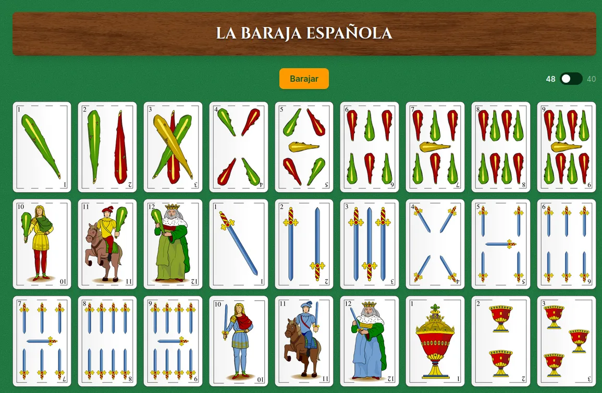
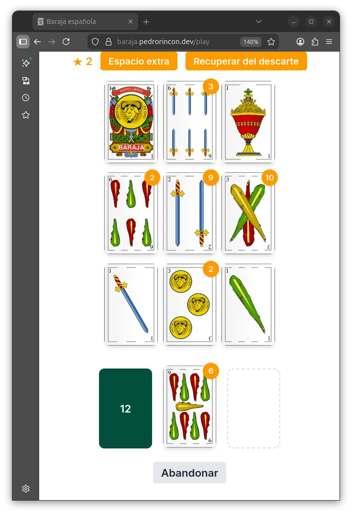
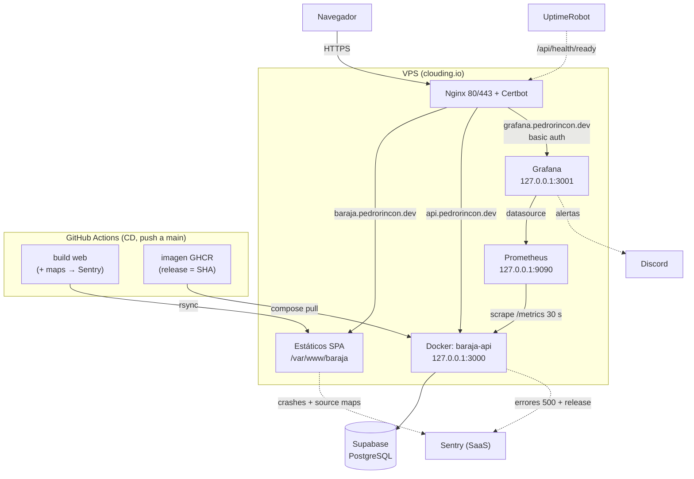
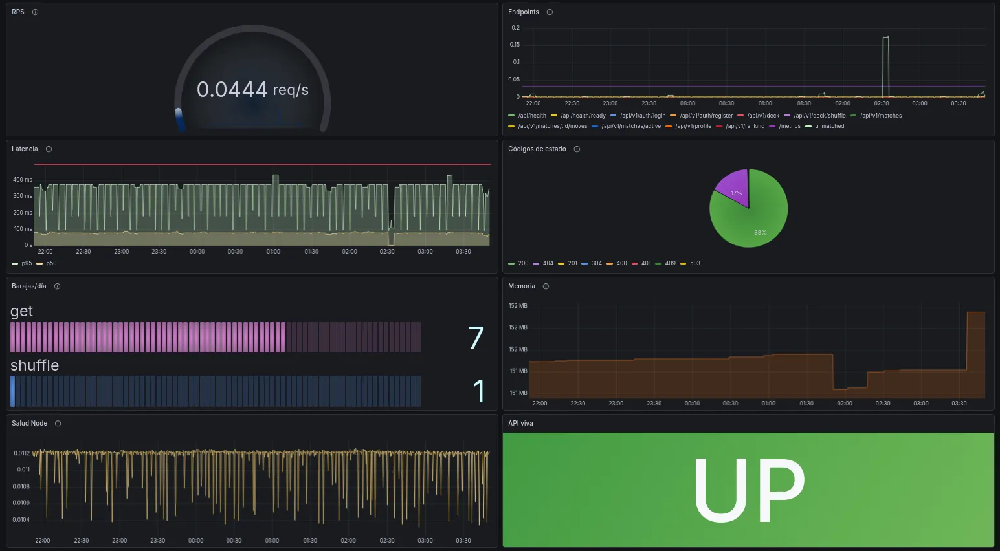
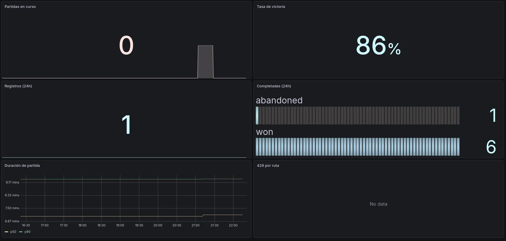

# barajaAPI


[](https://codecov.io/gh/P-Drop/barajaAPI)

[](https://github.com/P-Drop/barajaAPI/actions/workflows/dependabot/dependabot-updates)

[](https://api.pedrorincon.dev/api/health)


Plataforma de juegos con la baraja española: una **API REST** pública y una **aplicación web** donde jugar al **Solitario Orda**, un solitario original con su propio reglamento.

- 🎮 **Jugar:** [https://baraja.pedrorincon.dev/play](https://baraja.pedrorincon.dev/play) - _Requiere login_
- 🃏 **Catálogo:** [https://baraja.pedrorincon.dev/](https://baraja.pedrorincon.dev)
- 🔌 **API:** [https://api.pedrorincon.dev](https://api.pedrorincon.dev) — Swagger en [/api/docs](https://api.pedrorincon.dev/api/docs)
- 🗺️ **Planificación (estado y siguientes fases):** [ROADMAP](./ROADMAP.md)

Monorepo (npm workspaces) con dos aplicaciones: `apps/api` (Express + Prisma) y `apps/web` (React + Vite).

## Solitario Orda

Adaptación original del juego del solitario con la baraja completa (48 cartas + 2 comodines). El objetivo es **ordenar los cuatro palos del As (1) al Rey (12)** en las cuatro esquinas del tablero.

**El tablero** es una matriz de 3×3: las cinco posiciones centrales forman la **cruz**, donde se apilan cartas en orden descendente alternando palo (una sota de oros admite un 9 de copas encima, no un 9 de oros); las cuatro esquinas acumulan cada palo en orden ascendente estricto. Junto al tablero, la **pila de robo** (45 cartas) y la **pila de descarte**.

**El ritmo** son 45 rondas: robas una carta, la colocas donde sea legal —o la descartas, que siempre es una opción— y encadenas todos los movimientos que quieras antes de volver a robar. La partida nunca se bloquea: la carta en mano siempre puede ir al descarte. En caso de que el jugador considere que no puede progresar, siempre está disponible la opción de **abandonar** la partida.

**Al robar un comodín se convierte en una estrella**, que puede ser acumulada o gastada en una de dos cosas: desbloquear un espacio extra donde aparcar una carta, o rescatar cualquier carta del descarte (no sólo la de arriba). Guardarlas puntúa más que usarlas.

**Puntuación**, de 0 a 5 estrellas, que se acumulan en el perfil:

| Estrellas | Resultado | Comodines usados | Tiempo   |
| --------- | --------- | ---------------- | -------- |
| 0         | Derrota   | —                | —        |
| 1         | Victoria  | 2                | —        |
| 2         | Victoria  | 1                | ≥ 10 min |
| 3         | Victoria  | 1                | < 10 min |
| 4         | Victoria  | 0                | ≥ 5 min  |
| 5         | Victoria  | 0                | < 5 min  |

El **ranking** ordena por estrellas acumuladas y desempata por **menos tiempo total** de juego: gana quien consigue más estrellas en menos tiempo. El cronómetro lo mide el servidor.

**Escalera mecánica** es el único logro del MVP, y hay que descubrirlo jugando: consiste en desmontar una escalera de cuatro cartas o más hacia el descarte y remontarla sobre otra pila de la cruz, todo seguido y en la misma ronda. Una vez desbloqueado queda en el perfil para siempre y habilita el **movimiento en bloque**: desplegar una pila, elegir una carta interior y arrastrar con ella todas las que tiene encima.

📖 Reglas completas: [docs/ReglasSolitarioOrda.md](docs/ReglasSolitarioOrda.md)

## Cómo funciona por dentro

- **Server-authoritative**: el cliente propone movimientos y sólo el servidor decide si son legales. El motor de reglas vive en `apps/api/src/games/orda/` como **dominio puro** — sin HTTP, sin Prisma y sin reloj —, con la forma de un reducer: `applyMove(state, move) → MoveResult`.

- **Estado en PostgreSQL**: cada partida se guarda como snapshot JSON completo con una columna `version` para **bloqueo optimista**; dos peticiones simultáneas no se pisan, la segunda recibe un 409. El estado sobrevive a los despliegues, que ocurren en cada merge a `main`.

- **La vista del jugador no es el estado**: la API serializa una proyección (`PlayerView`) donde la pila de robo es sólo un número. Con las DevTools abiertas no hay nada que espiar, porque las cartas no reveladas nunca viajan.

- **Abandono por inactividad**: sin heartbeat ni procesos programados. Una partida cuyo `lastMoveAt` supera el TTL se consolida como derrota la próxima vez que alguien la toca. El tiempo de partida contabiliza hasta el último movimiento, es decir, que el tiempo de ausencia no se acumula en el perfil del jugador.

- **Identidad sin datos personales**: nickname anónimo, contraseña (argon2id) y avatar. Sin email, sin recuperación de cuenta y sin superficie legal que gestionar.

Las alternativas descartadas y sus porqués están en los [ADRs](docs/adr/); la forma del motor, en el [design doc](docs/design/motor-solitario-orda.md).

## Tecnologías

#### Backend

- Node.js 24 + TypeScript 7 (ESM)
- Express 5
- PostgreSQL + Prisma 6 (ORM)
- Zod 4 (validación de entrada y de entorno)
- jose (JWT) y argon2 (hashing)
- express-rate-limit
- pino (logging estructurado)
- OpenAPI / Swagger generado desde los propios schemas Zod
- prom-client (métricas Prometheus) y Sentry (error tracking)
- Vitest + Supertest (testing)
- Helmet y CORS

#### Frontend

- React 19 + React Router
- Vite 8 + TypeScript 7
- Tailwind CSS 4
- Cliente `fetch` tipado con los tipos generados del OpenAPI
- Vitest + Testing Library (jsdom)
- Sentry (ErrorBoundary + source maps)

#### Calidad e infraestructura

ESLint 10 + Prettier · GitHub Actions (CI/CD) · Docker · GHCR · Nginx + Certbot · Prometheus + Grafana · release-please

## Requisitos

- Node.js >= 24
- npm >= 11
- Docker (para la base de datos local y los tests de integración)

## Instalación

```bash
git clone https://github.com/P-Drop/barajaAPI.git
cd barajaAPI
npm install
```

## Variables de entorno

`cp apps/api/.env.example apps/api/.env`

**API** (`apps/api/.env`):

| Variable                     | Descripción                                                    |
| ---------------------------- | -------------------------------------------------------------- |
| `DATABASE_URL`               | Cadena de conexión a PostgreSQL                                |
| `PORT`                       | Puerto del servidor (3000)                                     |
| `NODE_ENV`                   | development / production / test                                |
| `LOG_LEVEL`                  | Nivel de pino (info por defecto)                               |
| `CORS_ORIGIN`                | Origen permitido; `*` en dev, lista por comas en producción    |
| `JWT_SECRET`                 | Secreto de firma HS256 (mínimo 32 caracteres)                  |
| `JWT_EXPIRES_IN`             | Vigencia del token (7d)                                        |
| `MATCH_TTL_MINUTES`          | Inactividad tras la cual una partida se da por abandonada (15) |
| `RATE_LIMIT_MAX`             | Peticiones por IP y ventana en la API general (100)            |
| `RATE_LIMIT_WINDOW_MS`       | Ventana general en ms (900000 = 15 min)                        |
| `AUTH_RATE_LIMIT_MAX`        | Límite más estricto para `/auth` (10 por ventana general)      |
| `MATCH_RATE_LIMIT_WINDOW_MS` | Ventana propia de las partidas en ms (60000 = 1 min)           |
| `MATCH_RATE_LIMIT_MAX`       | Peticiones por **jugador** y minuto (120)                      |
| `MATCH_IP_RATE_LIMIT_MAX`    | Peticiones por **IP** y minuto (300)                           |
| `SENTRY_DSN`                 | DSN del proyecto; vacío deshabilita Sentry                     |
| `SENTRY_RELEASE`             | Release reportada (el CD la fija al SHA del commit)            |

**Infraestructura local** (`.env` de la raíz): `POSTGRES_USER`, `POSTGRES_PASSWORD`, `POSTGRES_DB` y `POSTGRES_PORT` para el contenedor de Postgres.

**Web** (`apps/web/.env.development` y `.env.production`, versionados): `VITE_API_BASE_URL` y `VITE_SENTRY_DSN`. Vite las **embebe en build-time**: quedan congeladas en el bundle, no se leen en runtime.

> El rate limiting de las partidas usa **dos capas**: una por IP antes de autenticar, como escudo frente a tráfico anónimo, y otra por jugador después, para que varios usuarios tras el mismo NAT no compartan castigo. Los límites están dimensionados con el ritmo de juego real medido en producción.

## Desarrollo

```bash
# 1. Levantar PostgreSQL (escucha solo en 127.0.0.1)
docker compose up -d

# 2. Migrar y sembrar las 50 cartas
cd apps/api
npx prisma migrate deploy && npx prisma db seed

# 3. API en http://localhost:3000 (logs legibles)
npm run dev -w api

# 4. Web en http://localhost:5173
npm run dev -w web
```

## Scripts

**API** (desde la raíz con `-w api`):

| Script                     | Qué hace                                    |
| -------------------------- | ------------------------------------------- |
| `npm run dev`              | Servidor en desarrollo (con recarga)        |
| `npm run build`            | `prisma generate` + compilación a `dist/`   |
| `npm start`                | Arranca el servidor ya compilado            |
| `npm test`                 | Tests e2e con repositorio mockeado (sin BD) |
| `npm run test:integration` | Tests contra la BD real (requiere Docker)   |
| `npm run test:coverage`    | Tests con los umbrales de cobertura del CI  |

**Web** (`-w web`):

| Script                  | Qué hace                         |
| ----------------------- | -------------------------------- |
| `npm run dev`           | Servidor de desarrollo de Vite   |
| `npm run build`         | Typecheck + bundle de producción |
| `npm test`              | Tests de componentes en jsdom    |
| `npm run test:coverage` | Tests con los umbrales del CI    |

**Calidad** (desde la raíz): `npm run lint` · `npm run format` · `npm run format:check`

**Contrato** (desde la raíz): `npm run gen:contract` regenera `apps/api/openapi.json` y `apps/web/src/api/generated/schema.d.ts`. **No necesita la API levantada**: el spec sale de los schemas Zod. Una vez, para instalar el generador: `npm ci --prefix tools/openapi-gen`.

## API

Operacional (sin versionar):

| Método | Ruta                | Descripción                     |
| ------ | ------------------- | ------------------------------- |
| GET    | `/api/health`       | Liveness                        |
| GET    | `/api/health/ready` | Readiness (verifica PostgreSQL) |

Baraja (`/api/v1`):

| Método | Ruta                 | Descripción                             |
| ------ | -------------------- | --------------------------------------- |
| GET    | `/deck`              | Baraja completa (`?short=true` para 40) |
| GET    | `/deck/shuffle`      | Baraja barajada                         |
| GET    | `/deck/draw?count=N` | Robar N cartas                          |

Juego y jugador (`/api/v1`, 🔒 requiere `Authorization: Bearer`):

| Método | Ruta                    | Descripción                                    |
| ------ | ----------------------- | ---------------------------------------------- |
| POST   | `/auth/register`        | Alta con nickname, contraseña y avatar         |
| POST   | `/auth/login`           | Devuelve el JWT                                |
| GET    | 🔒 `/auth/me`           | Usuario del token                              |
| POST   | 🔒 `/matches`           | Crea partida (el servidor baraja)              |
| GET    | 🔒 `/matches/active`    | Partida en curso, para reanudarla              |
| GET    | 🔒 `/matches/:id`       | Vista de la partida                            |
| POST   | 🔒 `/matches/:id/moves` | Aplica un movimiento y devuelve la vista nueva |
| GET    | 🔒 `/profile`           | Perfil propio (estrellas, logros, tiempo)      |
| PATCH  | 🔒 `/profile`           | Cambiar avatar                                 |
| DELETE | 🔒 `/profile`           | Baja lógica (reconfirma la contraseña)         |
| GET    | `/ranking`              | Ranking paginado (`limit`, `offset`)           |

📖 Documentación interactiva (Swagger): http://localhost:3000/api/docs

## Frontend (`apps/web`)



SPA en React 19 que consume la API pública. Contiene el **tablero jugable del Solitario Orda** (comodines y movimiento en bloque incluidos), registro y login, perfil con logros y ranking, además del catálogo de la baraja que valida los endpoints de la Fase 1.

- **Cliente tipado desde el OpenAPI:** el spec se genera de los schemas Zod del backend (`apps/api/openapi.json`) y de ahí salen los tipos del front (`src/api/generated/schema.d.ts`). Los dos están versionados y se regeneran juntos con `npm run gen:contract`, y **el CI falla si alguno queda desfasado**: un cambio de contrato aparece siempre en el diff del PR, que es donde debe discutirse.

- **Sesión:** el token se guarda en `sessionStorage` y se accede sólo desde la capa de autenticación ([ADR-0004](docs/adr/0004-almacenamiento-del-token.md)).

<p align="center">

</p>

> El diseño actual prioriza lo funcional sobre lo visual. La **Fase 6** rehace la interfaz: sistema de diseño, uso desde el móvil y accesibilidad WCAG 2.2 AA.

Los naipes derivan de [«Baraja española completa»](https://commons.wikimedia.org/wiki/File:Baraja_espa%C3%B1ola_completa.png)
de Basquetteur (Wikimedia Commons), bajo [CC BY-SA 3.0](https://creativecommons.org/licenses/by-sa/3.0/).

## Producción

Arquitectura dual: la API en **https://api.pedrorincon.dev** y la web en **https://baraja.pedrorincon.dev**.



- **Infra:** VPS (clouding.io) con Docker; **Nginx** como reverse proxy y **Certbot** (HTTPS con auto-renovación) en ambos dominios.
- **Base de datos:** Supabase (PostgreSQL gestionado).
- **Despliegue continuo:** cada merge a `main` dispara `cd.yml` → tests → imagen en GHCR → migraciones → deploy por SSH y sincronización de los estáticos por rsync.
- **Versionado:** release-please mantiene un Release PR; al mergearlo publica tag, CHANGELOG y release.
- **Caché de estáticos** en Nginx con [política documentada](deploy/docs/http-cache.md).

> Despliegue manual (si hiciera falta), en el VPS dentro de `~/baraja`:
>
> ```bash
> docker compose pull && docker compose up -d
> ```

## Observabilidad





Cada petición y cada error son trazables de extremo a extremo:

- **Request-id:** toda respuesta incluye `X-Request-Id` (se respeta el entrante o se genera). El mismo id correlaciona la respuesta, los logs (pino, JSON a stdout → `docker logs`) y el evento de Sentry.

- **Métricas Prometheus** (`GET /metrics`, sólo red interna): histograma de latencia por ruta y estado, métricas de Node (event loop, memoria), el counter de negocio `deck_operations_total` y las **métricas del juego** — partidas iniciadas y terminadas por desenlace, duración de partida, partidas en curso y registros de jugadores.

- **Panel de control** (Grafana en `grafana.pedrorincon.dev`, provisionado como código en `deploy/grafana/provisioning/`): RPS, latencia, códigos de estado, uso por endpoint, y la fila del juego con partidas activas, tasa de victoria, desenlaces y duración.

- **Alertas** (también como código): API caída, tasa de 5xx sostenida y rate limit disparado → webhook de Discord. UptimeRobot vigila `/api/health/ready` desde fuera como testigo independiente.

- **Errores centralizados** (Sentry): la API reporta los 500 no controlados con el request-id y `release` = SHA del commit; el front reporta crashes con stack traces simbolicados.

Operación: [runbook-operations](deploy/docs/runbook-operations.md) · Seguridad: [runbook-blue-team](deploy/docs/runbook-blue-team.md) · Base de datos: [runbook-db](deploy/docs/runbook-db.md).

## Estructura del proyecto

```bash
apps/
├─── api/
│    ├─── prisma/
│    │    ├─ migrations/        # migraciones (forward-only)
│    │    ├─ schema.prisma      # modelo de datos (Card, User, Match)
│    │    └─ seed.ts            # siembra las 50 cartas
│    ├─── scripts/
│    │    └─ generate-openapi.ts  # escribe el spec sin levantar el servidor
│    ├─── src/
│    │    ├─ config/            # env (Zod), logger, métricas, JWT, Sentry
│    │    ├─ controllers/       # handlers HTTP
│    │    ├─ db/                # cliente Prisma
│    │    ├─ docs/              # OpenAPI (registry + generación)
│    │    ├─ errors/            # DomainError, ConflictError, NotFoundError…
│    │    ├─ games/orda/        # motor de reglas (dominio puro, sin HTTP ni BD)
│    │    ├─ metrics/           # gauge de partidas activas (collect contra BD)
│    │    ├─ middlewares/       # auth, rate limiters, errores, métricas
│    │    ├─ repositories/      # acceso a datos (Prisma)
│    │    ├─ routes/            # agregador + rutas por recurso
│    │    ├─ schemas/           # schemas Zod (validan y documentan)
│    │    ├─ services/          # lógica de negocio
│    │    ├─ validators/        # validación de entrada
│    │    ├─ app.ts             # configuración de Express
│    │    └─ server.ts          # arranque
│    ├─── tests/
│    │    ├─ e2e/               # mockeados (rápidos, sin BD)
│    │    ├─ integration/       # contra Postgres real
│    │    └─ unit/              # motor de reglas
│    └─ openapi.json            # contrato generado (versionado; lo consume el front)
└─── web/
     ├─── src/
     │    ├─ api/               # cliente fetch tipado + tipos del OpenAPI
     │    ├─ auth/              # contexto de sesión y rutas protegidas
     │    ├─ components/        # tablero, naipes, overlays, toasts
     │    ├─ data/              # catálogo de logros
     │    ├─ hooks/             # useDeck, useMatch
     │    ├─ lib/               # utilidades de cartas
     │    ├─ pages/             # home, login, registro, juego, perfil, ranking
     │    └─ test/              # setup, factorías y helpers de render
     └─── public/
          ├─── cards/           # 49 naipes WebP (CC BY-SA 3.0, ver ATTRIBUTION.md)
          ├─── avatars/         # 20 avatares de jugador
          ├─── achievements/    # insignias de logros
          └─── textures/        # texturas de la UI

docs/
├─── adr/                       # decisiones de arquitectura y sus alternativas
├─── design/                    # diseño del motor del Solitario Orda
└─── ReglasSolitarioOrda.md     # reglas canónicas del juego

deploy/
├─── docs/                      # runbooks y política de caché HTTP
├─── nginx/                     # server blocks (copia versionada)
├─── prometheus/                # configuración del scrape
├─── grafana/provisioning/      # dashboard y alertas como código
└─── docker-compose.prod.yml    # compose de producción del VPS

tools/
└─── openapi-gen/               # generador de tipos con npm propio (exige TypeScript 5)

```

## Tests

Ambos workspaces se ejecutan en el CI con umbrales de cobertura (líneas y statements ≥ 90 %, funciones y ramas ≥ 80 %).

Los **e2e de la API** van mockeados: cubren HTTP, validación y edge cases sin tocar la base de datos, y la suite entera pasa con Docker parado. La **integración** sólo verifica el cableado real contra Postgres, sin duplicar casos. Los **unitarios** cubren el motor de reglas, que al ser dominio puro se testea sin infraestructura. El **front** testea comportamiento visible (Testing Library) con el cliente HTTP mockeado.

```bash
# API — e2e mockeados (rápidos, sin BD)
npm test -w api

# API — integración contra Postgres real
docker compose up -d
npm run test:integration -w api

# Web — componentes en jsdom (API mockeada)
npm test -w web

# Cobertura con los umbrales que exige el CI
npm run test:coverage -w api
npm run test:coverage -w web
```
